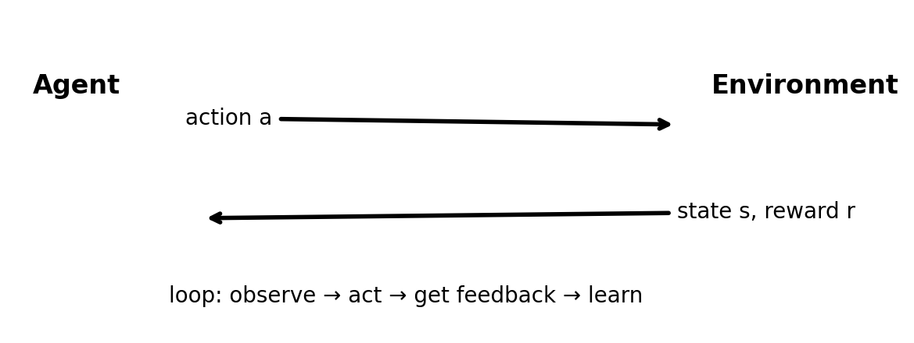

# 00 · 10 分钟理解强化学习（RL）

> 目标：用最少的数学，把 RL 的“结构”看清楚。你只需要记住：**RL = 试错 + 反馈 + 长期目标**。

---

## 0. RL 交互回路（一张图看懂）



```mermaid
flowchart LR
  A[Agent\n策略 π(a|s)] -- 选择动作 a --> E[Environment\n环境]
  E -- 返回状态 s' 与奖励 r --> A
  A -. 用 (s,a,r,s') 学习更新 .-> A
```

## 1. 一个最直观的故事：教机器人学走路
想象你在训练一个小机器人：
- 你不会给它每一步“标准答案”（监督学习那种标签）
- 你只能在它走完一段后说：
  - 走得稳：+1
  - 摔倒：-1
  - 走得慢：-0.1

机器人必须自己尝试很多动作序列，逐渐学会“哪些动作组合会带来更高的长期得分”。

这就是 RL。

---

## 2. RL 和监督学习/无监督学习最关键的区别
### 监督学习（Supervised Learning）
- 数据是固定的：`(x, y)`
- 目标是学一个映射：`f(x) ≈ y`
- 模型的行为不会影响后续数据的分布

### 强化学习（Reinforcement Learning）
- 没有标准答案，只有反馈（奖励）
- 你的策略会改变你采到的数据（你学会了更爱去哪儿探索，数据分布就变了）
- 奖励往往**延迟**：现在做的事可能很久后才体现好坏

> 一句话：监督学习在“给定答案的题库”里学习；RL 在“会被你改变的世界”里学习。

---

## 3. RL 的 5 个零件（记住它们就能读懂 80% 的 RL）
我们用最常见的形式：

- **状态（state）s**：你现在处境的摘要（迷宫里你在哪格）
- **动作（action）a**：你可以做的选择（上/下/左/右）
- **奖励（reward）r**：环境给你的即时反馈（+1 / 0 / -1）
- **策略（policy）π(a|s)**：在状态 s 时怎么选动作（可以是规则，也可以是神经网络）
- **回报（return）G**：从现在开始未来奖励的加和（通常折扣）

折扣因子 **γ（gamma）∈[0,1)**：
- γ 越小：更在乎短期（“快餐式收益”）
- γ 越大：更在乎长期（“长期主义”）

为什么要折扣？
1) 未来更不确定；2) 无限时域的数学稳定性；3) 让“近期奖励”更重要。

---

## 4. 一个你会反复见到的“长期奖励”定义
回报（Return）常写作：

\[ G_t = r_t + \gamma r_{t+1} + \gamma^2 r_{t+2} + ... \]

你不用背公式，记住直觉：
> **现在的奖励 +（打折后的）未来奖励**。

---

## 5. RL 两条主线：值函数派 vs 策略派
### A) 值函数（Value-based）
学一个“打分器”：
- **V(s)**：从状态 s 开始，长期能拿到多少分
- **Q(s,a)**：在 s 做 a，长期能拿到多少分

有了 Q，做决策很简单：
> 在 s 选 Q(s,a) 最大的动作

典型算法：Q-learning、DQN。

### B) 策略梯度（Policy-based）
直接学一个会做动作的策略 π。
- 做了动作
- 拿到回报
- 让“带来好结果的动作”更常被选到

典型算法：REINFORCE、A2C/A3C、PPO。

### C) Actor-Critic（两者结合）
- **Actor**：策略（负责“做”）
- **Critic**：价值函数（负责“评”）

PPO 就是最常见的 Actor-Critic 家族成员之一。

---

## 6. RL 的三大坑（新手最容易踩）
1. **探索 vs 利用**：一直用“当前最优”会卡在次优；一直探索又学不收敛
2. **样本效率**：互动一次环境可能很贵（比如真实机器人）
3. **训练不稳定**：尤其深度 RL，常见“突然崩掉/震荡”

---

## 7. 本教程的学习路线（为什么这样排）
1) **Bandit**：专注“探索 vs 利用”（没有状态转移，降低复杂度）
2) **Gridworld/MDP**：引入“未来”和价值函数
3) **Q-learning**：最经典的值函数算法
4) **DQN**：把 Q-learning 扩展到更大状态空间（神经网络）
5) **PPO**：现代常用的策略梯度（更通用）
6) **离线 RL + OPE**：只有历史数据时如何学习/评估
7) **LLM 里的 RL**：RLHF/DPO/PRM/Verifier 等前沿

---

## 8. 小练习（强烈建议做）
- 练习 1：如果 γ=0，你的策略会变得怎样？（提示：极度短视）
- 练习 2：现实生活里有哪些“延迟奖励”的例子？（健身、学习、投资…）

下一章：`01_bandit_explore_exploit.md`
