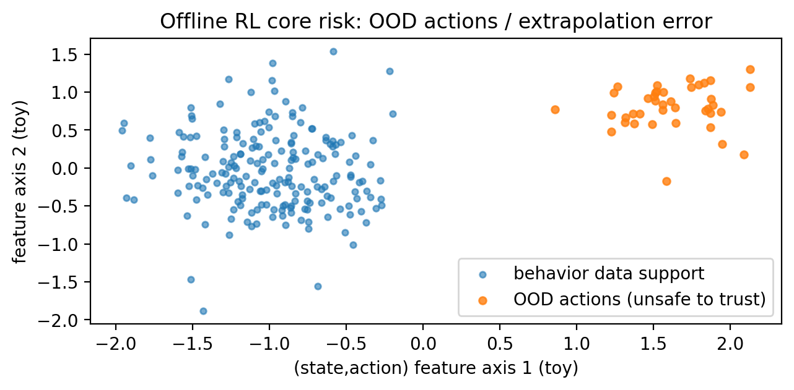

# 06 · 离线 RL（Offline RL）与离线评估（OPE）：只有历史数据也能学

> 这一章目标：理解离线 RL 最大风险——**分布外（OOD）动作**，以及为什么评估比训练更难。

---

## 0. 离线 RL 的核心风险：学到数据没覆盖的动作



```mermaid
flowchart LR
  D[离线数据集 D\n(来自行为策略 b)] --> train[训练 Q / π]
  train --> pi[目标策略 π]
  pi -->|选择 OOD 动作| ood[数据未覆盖区域]
  ood -->|Q 估计不可靠\n误差被放大| risk[上线风险]
  D -->|数据支持区域| safe[更可信]
```

## 1. 生动案例：医疗治疗策略能不能“在线探索”？
医疗决策是典型的“不能乱试”的场景：
- 你不能为了探索，给病人随机用药
- 你往往只有历史治疗日志

于是你只能做离线学习。

---

## 2. 离线 RL 和离策略 RL 的区别
很多人容易混：
- **离策略 RL（off-policy RL）**：算法层面，学习目标策略≠行为策略（Q-learning 就是）
- **离线 RL（offline RL）**：数据层面，你不能再与环境交互，只能用固定数据集

离线 RL 比普通 off-policy 更难，因为你无法补充缺失的数据覆盖。

---

## 3. 离线 RL 的核心难点：OOD（Out-of-Distribution）
离线数据只覆盖了行为策略 b 做过的动作。
如果你学出一个目标策略 π 喜欢选 b 没做过的动作：
- 你对这些动作的 Q 值估计完全可能是“瞎猜”
- 由于 `max`/策略改进，错误会被放大（extrapolation error）

> 一句话：离线 RL 的灾难，常常来自“对数据没覆盖的地方过度自信”。

---

## 4. 常见离线 RL 的解决思路（知道直觉即可）
- **Behavior Cloning (BC)**：先模仿历史行为（安全但可能不够好）
- **Conservative Q-Learning (CQL)**：让 Q 对 OOD 动作更保守（惩罚未见动作）
- **IQL (Implicit Q-Learning)**：避免显式对动作做 `max` 的高估扩散
- **BCQ**：限制策略只在数据支持的动作附近改进

它们的共同点：
> 让学习到的策略别偏离数据太远，或者对偏离数据的动作更不信任。

---

## 5. 不上线怎么评估？OPE（Off-Policy Evaluation）
OPE 的任务：
- 只用离线数据
- 估计目标策略 π 的期望回报

常见方法族：

### 5.1 重要性采样（IS / WIS）
核心：用概率比把数据从 b 的分布“改装”成 π 的分布。
优点：理论上无偏
缺点：方差可能爆炸（尤其长序列）

### 5.2 模型法（Model-based OPE）
学一个环境模型（Dynamics + Reward），然后在模型里模拟 π。
优点：可能更低方差
缺点：模型误差会累积（model bias）

### 5.3 Doubly Robust（DR）
把 IS 和模型法组合：
- 用模型做基线
- 用 IS 修正偏差

通常更稳健。

---

## 6. 本仓库提供的“概念演示版”流程
我们在 gridworld 里：
1) 用一个行为策略生成日志数据集 `data/offline_grid.csv`
2) 用 toy 版 IS/DR 展示 OPE 的结构

文件：
- `code/offline/make_offline_dataset.py`
- `code/offline/ope_is_dr.py`

运行：
```bash
python3 code/offline/make_offline_dataset.py
python3 code/offline/ope_is_dr.py
```

> 注意：这里的 IS/DR 为了可读性做了大幅简化（按 one-step 示意）。如果你希望“更完整的序列 OPE + 真实 π/b 概率建模”，我可以在下一轮把这章升级成更工程化版本。

---

## 7. 小练习
1) 让行为策略更随机（ε 更大），OPE 会更容易还是更难？为什么？
2) 让目标策略更“激进”（更多选择数据里没出现的动作），评估会更不稳定吗？

下一章：`07_rl_for_llm_frontiers.md`
